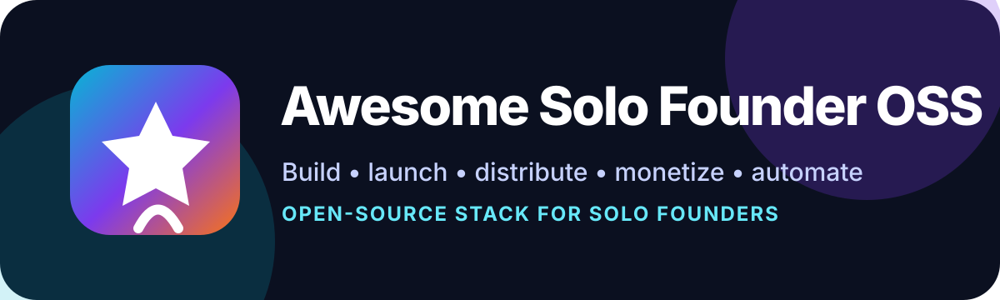

  

<h1 align="center">Awesome Solo Founder OSS</h1>

  <strong>Open-source stack for solo founders to build, launch, distribute, monetize, support, and automate polished products.</strong>

  
  
  

Open-source and source-available tools for solo founders building polished internet businesses.

Goal: help one person move from idea to shipped product, distribution, support, and revenue without buying a giant SaaS stack.

> Not a guarantee of revenue. This repo maps practical tools and workflows that can help a solo founder reach serious revenue targets.

## Quick start

- Need MVP fast? Start with [Open SaaS](https://github.com/wasp-lang/open-saas), [Supabase](https://github.com/supabase/supabase), or [PocketBase](https://github.com/pocketbase/pocketbase).
- Need launch video? Use [Hyperframes](https://github.com/heygen-com/hyperframes) or [OpenScreen](https://github.com/siddharthvaddem/openscreen).
- Need content trends? Use [last30days-skill](https://github.com/mvanhorn/last30days-skill), [twitter-cli](https://github.com/public-clis/twitter-cli), [rdt-cli](https://github.com/public-clis/rdt-cli), [ig-cli](https://github.com/princepal9120/ig-cli), and [tkt-cli](https://github.com/princepal9120/tkt-cli).
- Need distribution? Use [Postiz](https://github.com/gitroomhq/postiz-app), [TryPost](https://github.com/trypostit/trypost), or [Mixpost](https://github.com/inovector/mixpost).
- Need monetization? Use [Polar](https://github.com/polarsource/polar), [Lago](https://github.com/getlago/lago), or [Kill Bill](https://github.com/killbill/killbill).

## Contents

- [Why this list exists](#why-this-list-exists)
- [Similar repos researched](#similar-repos-researched)
- [Selection rules](#selection-rules)
- [Founder lifecycle map](#founder-lifecycle-map)
- [Core stack](#core-stack)
  - [Build MVP](#build-mvp)
  - [Deploy and operate](#deploy-and-operate)
  - [Analytics and product learning](#analytics-and-product-learning)
  - [Marketing and distribution](#marketing-and-distribution)
  - [UGC and content engine](#ugc-and-content-engine)
  - [Product launch assets](#product-launch-assets)
  - [iOS/Android app launch assets](#iosandroid-app-launch-assets)
  - [Trend discovery](#trend-discovery)
  - [Sales, CRM, and support](#sales-crm-and-support)
  - [Billing and monetization](#billing-and-monetization)
  - [Docs, website, and polish](#docs-website-and-polish)
  - [Automation and AI-agent operations](#automation-and-ai-agent-operations)
- [Agent-readiness score](#agent-readiness-score)
- [Suggested folder expansion](#suggested-folder-expansion)
- [Contributing](#contributing)

## Why this list exists

Most startup lists mix paid tools, courses, credits, communities, and generic advice.

This list focuses on:

- OSS or source-available tools
- solo-founder useful workflows
- polished product building
- GTM, marketing, support, billing, analytics
- tools AI agents can operate through CLI, API, config, docs, or browser

## Similar repos researched

| Repo | Focus | Gap this repo fills |
| --- | --- | --- |
| [mezod/awesome-indie](https://github.com/mezod/awesome-indie) | Indie maker resources | Broad resources, not OSS-tool-stack first |
| [iAmCorey/awesome-indie-hacker-tools](https://github.com/iAmCorey/awesome-indie-hacker-tools) | Indie hacker tools | Useful, but mixed tool list, less lifecycle scoring |
| [KrishMunot/awesome-startup](https://github.com/KrishMunot/awesome-startup) | Startup resources | Broad startup resources, not solo + OSS execution stack |
| [xcomptek/awesome-saas-boilerplates](https://github.com/xcomptek/awesome-saas-boilerplates) | SaaS boilerplates | Strong build phase, not full business lifecycle |
| [EinGuterWaran/awesome-opensource-boilerplates](https://github.com/EinGuterWaran/awesome-opensource-boilerplates) | Open-source boilerplates | Build starter focus, not GTM/support/revenue |
| [open-saas-directory/awesome-saas-directory](https://github.com/open-saas-directory/awesome-saas-directory) | OSS SaaS projects | Directory angle, not founder operating system |
| [toofast1/awesome-micro-saas](https://github.com/toofast1/awesome-micro-saas) | Micro-SaaS stack | Good adjacent angle; this repo narrows to OSS + agent-ready |

## Selection rules

Good fit:

- Helps solo founder build, launch, sell, support, or grow.
- Has public source.
- Can be self-hosted, forked, scripted, or agent-operated.
- Has clear docs or usable examples.
- Replaces expensive SaaS cost center.

Avoid:

- Closed-source-only tools.
- Pure inspiration/motivation links.
- Abandoned repos with no clear maintenance path.
- Enterprise-only tools with unusable community edition.

## Founder lifecycle map

1. Idea and validation
2. Build MVP
3. Ship infrastructure
4. Analytics and feedback
5. Marketing and distribution
6. UGC and content engine
7. Product launch assets
8. iOS/Android app launch assets
9. Trend discovery
10. Sales, CRM, support
11. Billing and monetization
12. Docs, polish, trust
13. Automation and AI-agent operations

## Core stack

### Build MVP

| Project | Use |
| --- | --- |
| [supabase/supabase](https://github.com/supabase/supabase) | Backend, auth, database, storage |
| [appwrite/appwrite](https://github.com/appwrite/appwrite) | Backend platform |
| [pocketbase/pocketbase](https://github.com/pocketbase/pocketbase) | Tiny backend for fast MVPs |
| [wasp-lang/open-saas](https://github.com/wasp-lang/open-saas) | Free SaaS starter with auth, jobs, payments |
| [ixartz/SaaS-Boilerplate](https://github.com/ixartz/SaaS-Boilerplate) | Next.js SaaS boilerplate |

### Deploy and operate

| Project | Use |
| --- | --- |
| [coollabsio/coolify](https://github.com/coollabsio/coolify) | Self-hosted Vercel/Heroku alternative |
| [Dokploy/dokploy](https://github.com/Dokploy/dokploy) | Deployment platform |
| [caprover/caprover](https://github.com/caprover/caprover) | App deployment platform |
| [dokku/dokku](https://github.com/dokku/dokku) | Lightweight Heroku-style PaaS |
| [openstatusHQ/openstatus](https://github.com/openstatusHQ/openstatus) | Uptime monitoring and status pages |

### Analytics and product learning

| Project | Use |
| --- | --- |
| [PostHog/posthog](https://github.com/PostHog/posthog) | Product analytics, session replay, flags, surveys |
| [plausible/analytics](https://github.com/plausible/analytics) | Privacy-friendly web analytics |
| [umami-software/umami](https://github.com/umami-software/umami) | Simple web analytics |
| [Openpanel-dev/openpanel](https://github.com/Openpanel-dev/openpanel) | Product and web analytics |
| [formbricks/formbricks](https://github.com/formbricks/formbricks) | User research and surveys |

### Marketing and distribution

| Project | Use |
| --- | --- |
| [mautic/mautic](https://github.com/mautic/mautic) | Marketing automation |
| [knadh/listmonk](https://github.com/knadh/listmonk) | Newsletter and mailing lists |
| [usesend/useSend](https://github.com/usesend/useSend) | Transactional email platform |
| [gitroomhq/postiz-app](https://github.com/gitroomhq/postiz-app) | Social media scheduling |
| [trypostit/trypost](https://github.com/trypostit/trypost) | Social media scheduling |
| [nitishkgupta/seotoolsuite](https://github.com/nitishkgupta/seotoolsuite) | SEO tooling |
| [respectlytics/respectaso](https://github.com/respectlytics/respectaso) | App Store Optimization keyword research |
| [jawwadfirdousi/appstore-screenshots-generator](https://github.com/jawwadfirdousi/appstore-screenshots-generator) | App Store screenshots |

### UGC and content engine

Tools for repeatable content across TikTok, Instagram/Reels, YouTube/Shorts, X, LinkedIn, and Reddit.

| Project | Use | Platforms |
| --- | --- | --- |
| [gitroomhq/postiz-app](https://github.com/gitroomhq/postiz-app) | Social scheduling, AI content ops, MCP/API surface | TikTok, Instagram, YouTube, X, LinkedIn, Reddit, Threads, Bluesky, Mastodon, Pinterest, Discord, Slack |
| [trypostit/trypost](https://github.com/trypostit/trypost) | Social scheduling and content calendar | Instagram, Facebook, LinkedIn, X, TikTok, YouTube, Pinterest, Threads, Bluesky, Mastodon |
| [inovector/mixpost](https://github.com/inovector/mixpost) | Self-hosted Buffer-style social media management | Multi-platform social publishing |
| [zernio-dev/latewiz](https://github.com/zernio-dev/latewiz) | Open-source scheduler powered by Zernio API | Instagram, TikTok, YouTube, X, LinkedIn, Facebook, Pinterest, Threads, Bluesky, Snapchat, Telegram, Discord, Slack |
| [mutonby/openshorts](https://github.com/mutonby/openshorts) | AI UGC video platform, clip generator, YouTube Studio | TikTok, Instagram Reels, YouTube Shorts |
| [gyoridavid/short-video-maker](https://github.com/gyoridavid/short-video-maker) | MCP/REST short-video creation for agents | TikTok, Instagram Reels, YouTube Shorts |
| [Shaarav4795/ClippedAI](https://github.com/Shaarav4795/ClippedAI) | Open-source OpusClip-style shorts generator | YouTube Shorts, TikTok |
| [sw-aka/Short-Video-Creator](https://github.com/sw-aka/Short-Video-Creator) | AI captions and background videos | YouTube Shorts, TikTok, Instagram Reels, Snapchat Spotlight |
| [remotion-dev/remotion](https://github.com/remotion-dev/remotion) | Programmatic video generation with React | Platform-neutral video assets |

### Product launch assets

Tools for launch videos, product demos, screenshots, and polished campaign assets.

| Project | Use |
| --- | --- |
| [heygen-com/hyperframes](https://github.com/heygen-com/hyperframes) | Agent-friendly HTML-to-video launch videos |
| [siddharthvaddem/openscreen](https://github.com/siddharthvaddem/openscreen) | Free product demo videos, Screen Studio alternative |
| [heygen-com/hyperframes-launch-video](https://github.com/heygen-com/hyperframes-launch-video) | Hyperframes launch-video example |
| [heygen-com/hyperframes-launches](https://github.com/heygen-com/hyperframes-launches) | Open-source production launch-video compositions |
| [coleam00/hyperframes-ai-video-generation](https://github.com/coleam00/hyperframes-ai-video-generation) | URL-to-polished AI-voiced HyperFrames short workflow |
| [openclaw-easy/ViralMint](https://github.com/openclaw-easy/ViralMint) | Trend scouting, competitor analysis, AI video generation, auto-publishing |
| [jawwadfirdousi/appstore-screenshots-generator](https://github.com/jawwadfirdousi/appstore-screenshots-generator) | App Store screenshot generator |
| [chrisvanbuskirk/appshot](https://github.com/chrisvanbuskirk/appshot) | CLI for App Store screenshots |

### iOS/Android app launch assets

Tools for App Store / Google Play launch videos, screenshots, previews, and release automation.

| Project | Use | App launch job |
| --- | --- | --- |
| [mdo91/video-preview-appstore](https://github.com/mdo91/video-preview-appstore) | Convert screen recordings into App Store preview-compatible MP4s | iOS App Preview video |
| [eralpozcan/storeshots](https://github.com/eralpozcan/storeshots) | App Store and Google Play screenshot generator with device mockups | iOS/Android store screenshots |
| [jawwadfirdousi/appstore-screenshots-generator](https://github.com/jawwadfirdousi/appstore-screenshots-generator) | Browser-based App Store screenshot generator | iOS screenshots |
| [chrisvanbuskirk/appshot](https://github.com/chrisvanbuskirk/appshot) | CLI for App Store screenshots | iOS screenshot automation |
| [fastlane/fastlane](https://github.com/fastlane/fastlane) | Automate beta, deploy, screenshots, metadata, and release flow | iOS/Android release ops |
| [siddharthvaddem/openscreen](https://github.com/siddharthvaddem/openscreen) | Product demo screen recordings without watermark | Mobile app demo video |
| [heygen-com/hyperframes](https://github.com/heygen-com/hyperframes) | HTML-to-video launch explainers | App launch explainer |
| [remotion-dev/remotion](https://github.com/remotion-dev/remotion) | Programmatic videos with React | Store/social promo videos |

### Trend discovery

Tools for finding what people are already talking about before writing content.

| Project | Use | Sources |
| --- | --- | --- |
| [mvanhorn/last30days-skill](https://github.com/mvanhorn/last30days-skill) | Agent skill for recent-topic research and synthesis | Reddit, X, YouTube, Hacker News, Polymarket, web |
| [levineam/lastXdays-skill](https://github.com/levineam/lastXdays-skill) | Configurable time-range version of last30days research | Same pattern, variable date window |
| [public-clis/public-clis](https://github.com/public-clis/public-clis) | CLI catalog for public web services | Multiple platforms |
| [public-clis/twitter-cli](https://github.com/public-clis/twitter-cli) | Terminal-first Twitter/X feed, bookmarks, timeline research | X/Twitter |
| [public-clis/rdt-cli](https://github.com/public-clis/rdt-cli) | Terminal-first Reddit feed, post, search, upvote, save workflow | Reddit |
| [princepal9120/ig-cli](https://github.com/princepal9120/ig-cli) | Instagram CLI for trend discovery workflow | Instagram |
| [princepal9120/tkt-cli](https://github.com/princepal9120/tkt-cli) | TikTok trend discovery CLI | TikTok |
| [Linked-API/linkedin-cli](https://github.com/Linked-API/linkedin-cli) | Agent-friendly LinkedIn account/data CLI | LinkedIn |
| [Panniantong/Agent-Reach](https://github.com/Panniantong/Agent-Reach) | Multi-platform search/read CLI for agents | Twitter, Reddit, YouTube, GitHub, Bilibili, XiaoHongShu |

Playbook: [trend-to-content engine](playbooks/trend-to-content-engine.md)

### Sales, CRM, and support

| Project | Use |
| --- | --- |
| [twentyhq/twenty](https://github.com/twentyhq/twenty) | Modern CRM |
| [espocrm/espocrm](https://github.com/espocrm/espocrm) | CRM |
| [chatwoot/chatwoot](https://github.com/chatwoot/chatwoot) | Customer support inbox and live chat |
| [frappe/helpdesk](https://github.com/frappe/helpdesk) | Helpdesk |
| [getfider/fider](https://github.com/getfider/fider) | Feature requests and feedback voting |
| [OpnForm/OpnForm](https://github.com/OpnForm/OpnForm) | Form builder |
| [heyform/heyform](https://github.com/heyform/heyform) | Form builder |

### Billing and monetization

| Project | Use |
| --- | --- |
| [polarsource/polar](https://github.com/polarsource/polar) | Developer payments, subscriptions, digital products |
| [getlago/lago](https://github.com/getlago/lago) | Usage-based billing |
| [killbill/killbill](https://github.com/killbill/killbill) | Subscription billing platform |

### Docs, website, and polish

| Project | Use |
| --- | --- |
| [facebook/docusaurus](https://github.com/facebook/docusaurus) | Documentation website |
| [docmost/docmost](https://github.com/docmost/docmost) | Knowledge base |
| [withastro/astro](https://github.com/withastro/astro) | Marketing/docs website framework |
| [plasmicapp/plasmic](https://github.com/plasmicapp/plasmic) | Visual builder for React |
| [GrapesJS/grapesjs](https://github.com/GrapesJS/grapesjs) | Web page builder framework |

### Automation and AI-agent operations

| Project | Use |
| --- | --- |
| [activepieces/activepieces](https://github.com/activepieces/activepieces) | Workflow automation, MCP, AI agents |
| [n8n-io/n8n](https://github.com/n8n-io/n8n) | Workflow automation with native AI features |

## Agent-readiness score

Use this when adding tools:

| Score | Meaning |
| --- | --- |
| 5 | CLI/API/docs/docker; agent can install, configure, and run workflows |
| 4 | API/docs good; minor manual setup |
| 3 | Browser-first; agent can operate but setup is slower |
| 2 | Good product, weak automation surface |
| 1 | Mostly manual |

## Suggested folder expansion

- `data/tools.yml` — structured database
- `playbooks/` — founder workflows
- `agent-recipes/` — OpenClaw/Codex/Claude/Cursor workflows
- `templates/` — launch copy, app store copy, pricing checklist

## Contributing

PRs welcome. Add tools with:

- repository URL
- license
- category
- best founder stage
- agent-readiness score
- reason it helps solo founders
